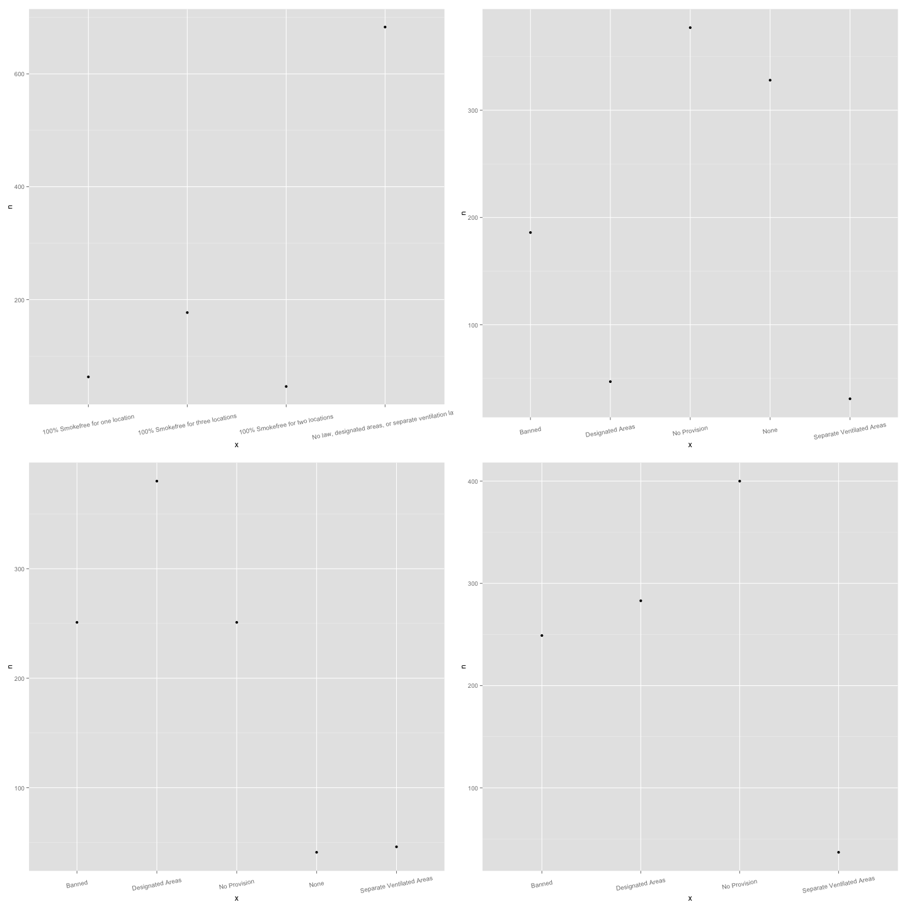
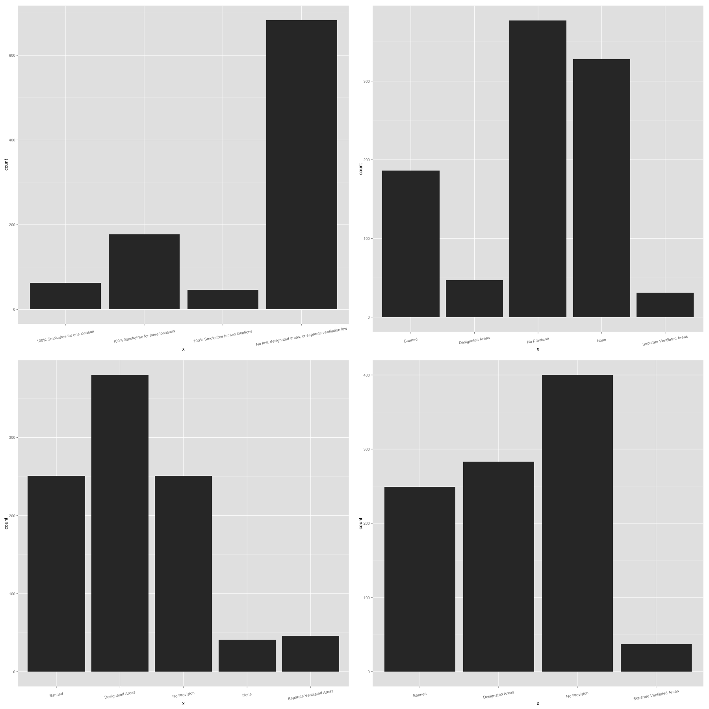

***The Esteemed Creators:*** *Juliette Seive, David Tran, Boris Boukhonine*
___
___

***Get data frames***

```{r}
source("../01 Data/package_loader.R", echo = FALSE)
source("../01 Data/dataframes.R", echo = TRUE)
```
___

***Wrangle data***

```{r}
source("../02 Data Wrangling/datawrangling.R", echo = TRUE)
```
___

***Visualize data***

```{r, fig.width=10,fig.height=10}
source("../03 Visualizations/visualizations.R", echo = TRUE)
```
___

***Generate PNG images***

```{r}
# source("../00 Doc/png.R", echo = TRUE)
```
___
***Categoricals 1 PNG***

___

***Categoricals 2 PNG***

